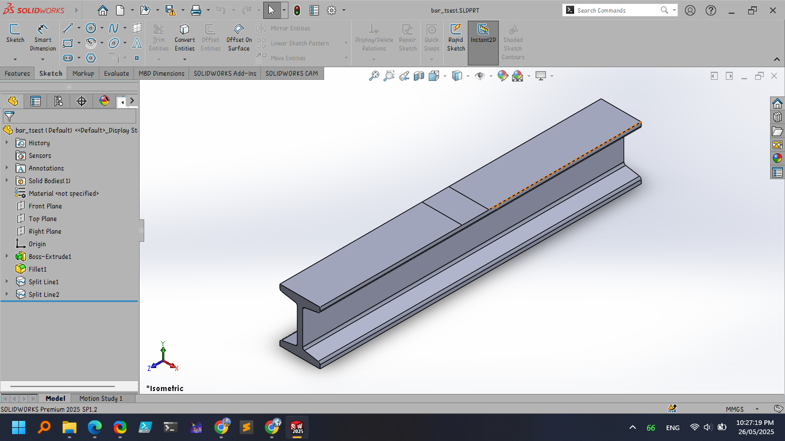
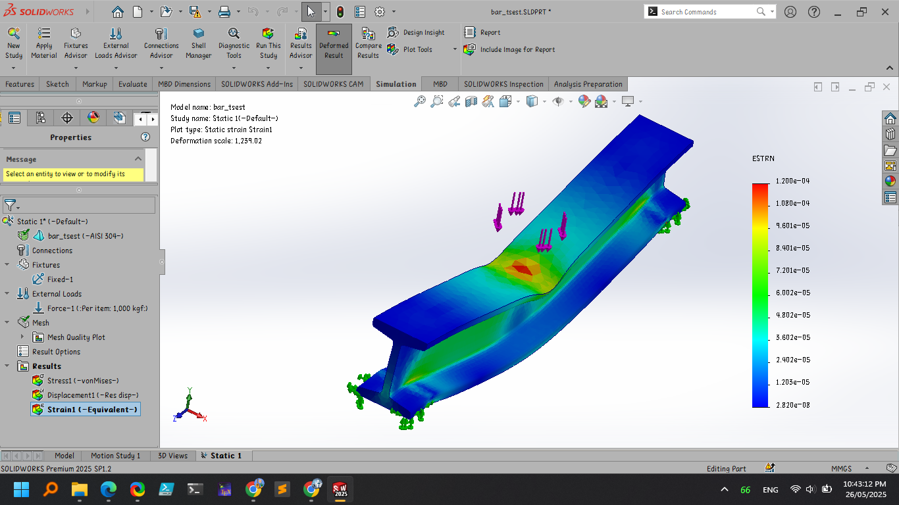
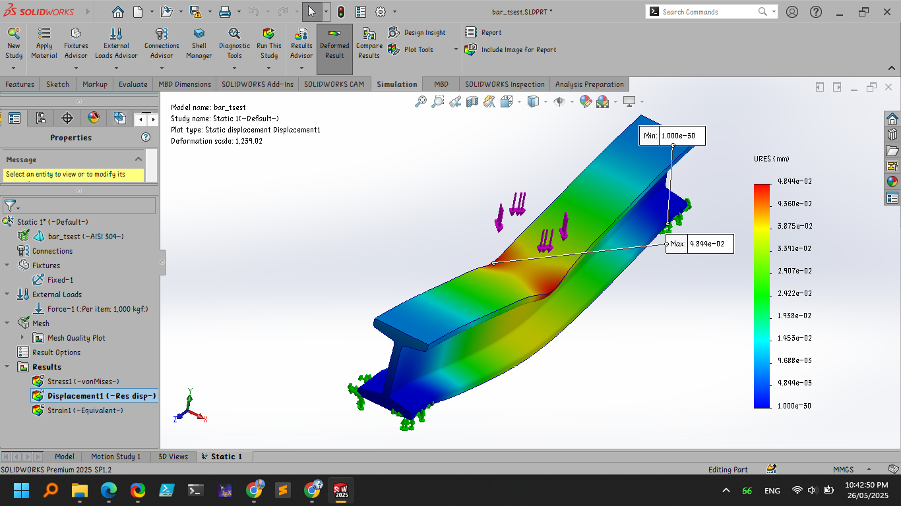
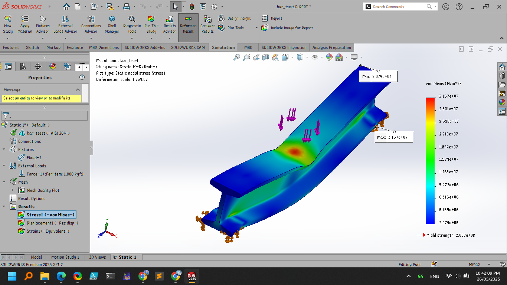
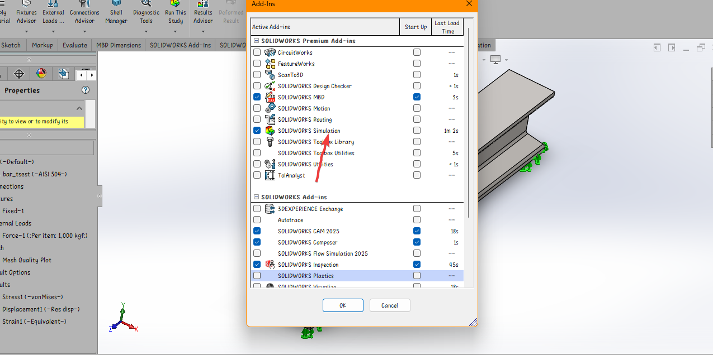

# Steel Bridge Bar Stress Analysis Model

This repository contains a simulation model for analyzing the **strain**, **displacement**, and **stress** of a typical steel bridge construction bar. The test model serves as a foundational tool for structural engineers, researchers, and students aiming to understand mechanical behavior under various load conditions.

---

## 🧠 Features

- Simulates **strain**, **displacement**, and **stress** distribution in a steel bar.
- Ideal for testing load responses in bridge construction scenarios.
- Can be extended or integrated with more complex structural simulations.

---

## 🖼️ Illustrations

The following visualizations provide insight into the output and performance of the model:
1. **3D Model Representation**  
   

2. **Strain Visualization**  
   

3. **Displacement Field**  
   

4. **Stress Distribution**  
   


---

## 🚀 Getting Started

1. **Clone the repository**

   ```bash
   git clone https://github.com/sployal/Solidworks_bartest_analysis

   ```

5. **Enabe the solidworrks simulation add in**  
   


## 🧪 Output

After running the simulation, result files including plots and numerical data will be saved in the `results/` directory. These outputs can be used for further analysis or validation of theoretical models.

---

## 📌 License

This project is licensed under the MIT License. See the `LICENSE` file for details.

---

## ✍️ Author

Created by [David muigai] – feel free to reach out or contribute!
